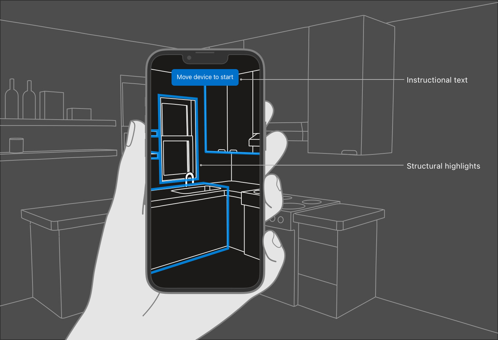
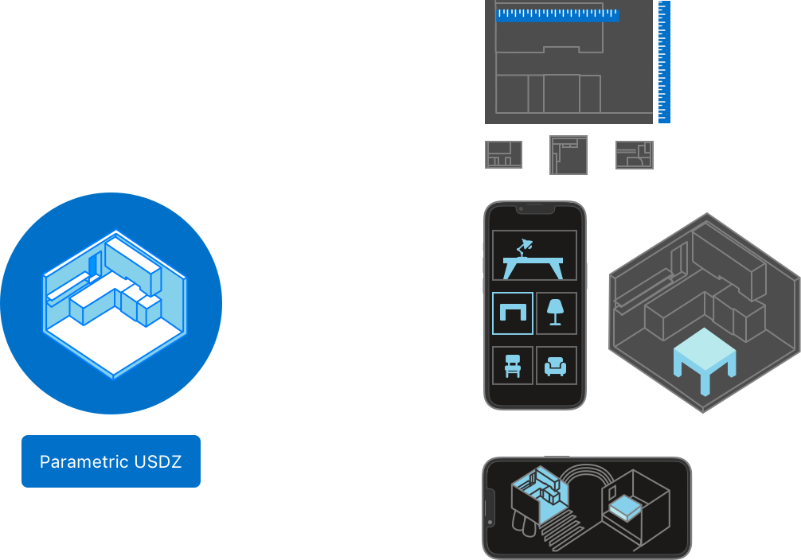

# RoomPlan - 3D Interior Room Scanning

## Overview
RoomPlan is a framework that allows users to create a 3D model of an interior room using a device's sensors, trained machine learning models, and RealityKit’s rendering capabilities. The framework analyzes a device’s camera feed and LiDAR readings to identify structural elements such as walls, windows, doors, and openings. Additionally, RoomPlan detects furniture and appliances, including fireplaces, beds, and refrigerators, and provides this information to the app.

## Features
### Room Capture View
To begin a capture, the app presents a **RoomCaptureView**, which allows the user to see their room in augmented reality. The view provides:
- **Real-time graphic overlays** that indicate scanning progress.
- **Instructional UI prompts** that guide the user to adjust their device’s position for an optimal scan.
- **A small-scale version of the scanned room**, which appears for user approval once the scan is complete.

### Scan Customization
Instead of using the default UI, developers can create a **RoomCaptureSession** object to implement custom scan experiences.

## Accessing Captured Results
RoomPlan provides scan results in **parametric data** format, enabling easy modification of individual room components. The framework also supports exporting results in various **Universal Scene Description (USD)** formats, allowing applications to:
- Estimate the size of specific areas within a room.
- Preview virtual furniture in different styles and positions.
- Integrate the scanned room model into 3D environments such as games or simulations.

## Processing on macOS with Mac Catalyst
While scanning requires a device with a camera, LiDAR, and AR support on iOS or iPadOS, macOS apps built with **Mac Catalyst** can process scan results. RoomPlan enables macOS apps to encode, decode, and export scan data while ignoring capture-session-related calls.

## Key Components
### Essentials
- **RoomCaptureView**: A view enabling users to scan a room using their device’s camera.
- **RoomCaptureViewDelegate**: A protocol that allows post-processing of scan results.
- **RoomCaptureSession**: Manages the scanning process.
- **RoomCaptureSessionDelegate**: Defines important events occurring during scanning.

### Captured Data
- **CapturedRoom**: Stores details of a single scanned room.
- **CapturedStructure**: Represents multiple merged room scans.
- **CapturedRoomData**: Holds raw scan results.

### 3D Asset Output
- **RoomBuilder**: Generates a 3D asset from captured room data.
- **StructureBuilder**: Merges multiple scans into a unified structure.
- **USDExportOptions**: Defines the data format for exported scan results.

## Advanced Features
### Merging Multiple Scans
- Combine multiple scans into a **single structure**.
- Export a 3D model of multiple rooms captured in the same physical vicinity.

### Object and Surface Attributes
- Analyze and determine details of objects and surfaces detected during a scan.
- Replace bounding boxes with high-quality **custom 3D models**.

## Conclusion
RoomPlan provides a powerful toolset for capturing and processing 3D room models. Whether used for real estate visualization, interior design, or gaming, its flexibility allows developers to integrate rich 3D experiences into their applications.

